# Guice Checker

A common challenge when building systems that use [Guice](https://github.com/google/guice) is dealing with dependencies and ensuring they are properly defined. Omitting or misconfiguring dependencies can lead to runtime errors, impacting the reliability and stability of code.

- [Guice Static Analysis](https://stackoverflow.com/questions/63446847/detect-all-injection-points-in-java-guice-via-static-code-analysis)
- [Bug in Modules](https://stackoverflow.com/questions/10686360/guice-how-to-print-a-modules-bindings)
- [Detecting Unused Bindings](https://stackoverflow.com/questions/55230580/guice-detect-unused-bindings)

The Guice Checker is a static analysis tool designed to address this issue by providing compile-time guarantees that your Guice dependency mappings are accurately defined.

## How to run the checker

First, build the checker by running `./gradlew clean build` and then publish the checker to your local Maven repository by running `./gradlew publishToMavenLocal` in this repository.

Then, if you use Gradle, add the following to the `build.gradle` file in
the project you wish to type-check:

```
plugins {
  id 'org.checkerframework' version '0.6.28'
  ...
}

...

apply plugin: 'org.checkerframework'
checkerFramework {
  checkers = [
    'org.checkerframework.checker.dependencyinjection.DependencyInjectionChecker',
  ]
}

...

dependencies {
    compileOnly 'org.checkerframework:dependencyinjection-checker-qual:0.1-SNAPSHOT'
    testCompileOnly 'org.checkerframework:dependencyinjection-checker-qual:0.1-SNAPSHOT'
    checkerFramework 'org.checkerframework:dependencyinjection-checker:0.1-SNAPSHOT'
    ...
}
```

Now, when you build your project, the Guice Checker will also run, informing you of any potential errors related to improperly defined or configured bindings.


## How the tool works

At compile time, the Guice Checker estimates what bindings the program may compute at run time.  It issues a warning if the program attempts to request a binding that has not been properly defined or configured. It works via a technique called pluggable typechecking.

Most of the time, the Guice Checker will work automatically. However, sometimes you may need to write an annotation to specify dataflow that is relevant to Guice bindings, if it crosses procedure boundaries. You can achieve that with the following type annotations:

`@Bind({})`

- The default qualifier of this system. If an expression's type has this qualifier, then the expression's value may not result from a method invocation of `com.google.inject.AbstractModule.bind`. It implies that no arguments have been passed to the `bind` method. Since this is the default type, programmers usually do not need to write it.

`@Bind({Baz.class})`

- If an expression's type has this qualifier, then the expression's value was definitely the result of a method invocation of `com.google.inject.AbstractModule.bind` that received the argument `Baz.class` in an `AbstractModule`. Its value represents the argument that was passed to the invocation of the `bind` method.

`@BindAnnotatedWith({Baz.class}, {"someName"})`

- If an expression's type has this qualifier, then the expression is definitely a call to `com.google.inject.binder.AnnotatedBindingBuilder.annotatedWith` on an `AnnotatedBindingBuilder` that received the argument `Baz.class` in an `AbstractModule`. It represents two things, the first one being the argument that was passed to the invocation of the `bind` method and the second being the argument that was passed to the invocation of the `annotatedWith` method. It is important to note that this qualifier is always a _supertype_ of `@Bind({Baz.class})` and a _subtype_ of `@Bind({})`. It can only ever contain the result of an `@Bind`, thus it cannot exist on its own.

`@BindAnnotatedWith({})`

- This qualifier cannot exist on its own. It is always a result of an `@Bind` and as such cannot be applied to an expression since it would mean that either a call to `bind` was made that received no arguments, _not possible_, or that no call to `bind` was ever made which would not be possible since `annotatedWith` is defined on the `AnnotatedBindingBuilder` class.

### Qualifier Hierarchy

```mermaid
graph TD;
    classDef node font-family: monospace;
    A["@Bind({})=⊤"]---B["@BindAnnotatedWith({})"];
    B["@BindAnnotatedWith({})"]---C["@BindAnnotatedWith({Baz.class}, {#quot;someName#quot;})"];
    C["@BindAnnotatedWith({Baz.class}, {#quot;someName#quot;})"]---D["@Bind({Baz.class})"];
    class A,B,C,D node;
```



## More information

The Guice Checker is built upon the Checker Framework. Please see the [Checker Framework Manual](https://checkerframework.org/manual/) for more information about using pluggable type-checkers, including this one.
